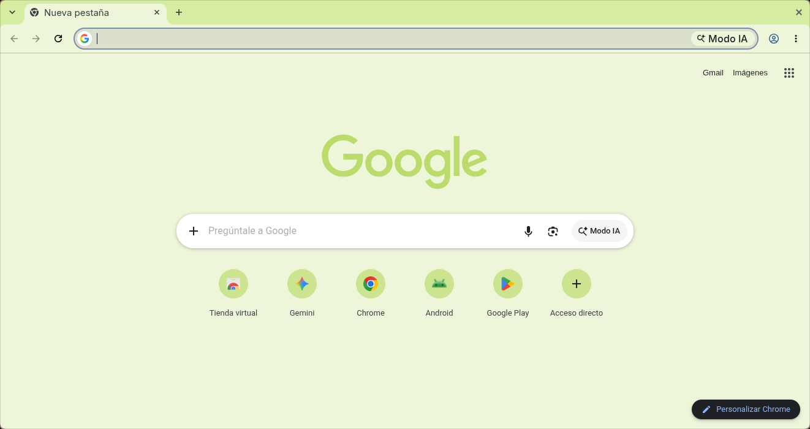

# Minimalist Yuzu

A minimal Chrome theme in a fresh, citrus palette, by Miguel Euraque.

A soft yellow-green frame, a pale lime toolbar and new tab page, and neutral gray text. The palette is the bright, citrusy green of yuzu, fresh and a little zesty.

## Features

- **Palette:** yellow-green frame, pale lime surfaces, neutral gray text
- **Minimalist design:** clean and uncluttered
- **Easy installation:** Chrome Manifest V3
- **Gentle on the eyes:** low-contrast colors that stay easy to read

## Installation

### From source

1. Clone this repository.
2. Open `chrome://extensions` and turn on Developer mode.
3. Click **Load unpacked** and select the theme folder.
